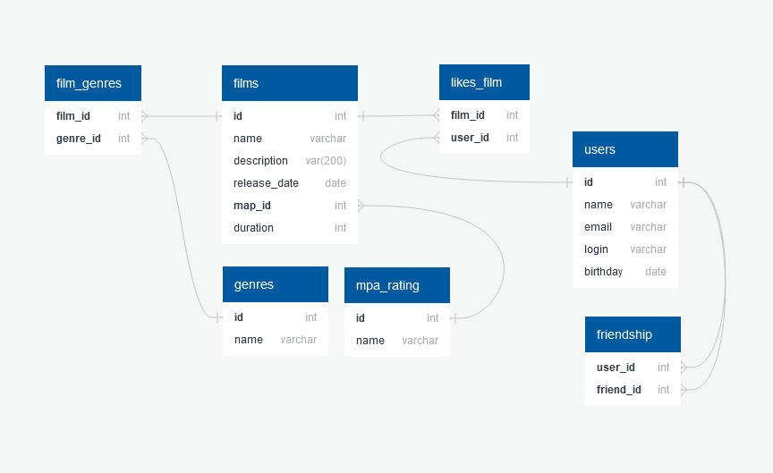

# java-filmorate
Template repository for Filmorate project.
 
 
 
 
 
 

# Описание схемы:
<!-- TOC -->
1. films:
<!-- TOC -->
* film_id - PK идентификатор фильма
* mpa_id FK (ссылает к таблице mpa_rating) - идентификатор рейтинга
* name - название фильма
* description - описание фильма
* release_date - дата релиза
* duration - продолжительность фильма
<!-- TOC -->
2. mpa_rating:
<!-- TOC -->
* mpa_id - PK идентификатор рейтинга
* name - наименование рейтинга
<!-- TOC -->
3. films_genres:
<!-- TOC -->
* film_id -PK (ссылается на таблицу films) идентификатор фильма
* genres_id - PK (ссылается на таблицу genres) идентификатор пользователя
<!-- TOC -->
4. genres:
<!-- TOC -->
* genre_id - PK идентификатор жанра
* name - название жанра
<!-- TOC -->
5. likes_films:
<!-- TOC -->
* film_id - PK (ссылается на таблицу films) идентификатор фильма
* user_id - PK (ссылается на таблицу users) идентификатор пользователя
<!-- TOC -->
6. users:
<!-- TOC -->
* user_id - PK идентификатор пользователя
* email - электронная почта пользователя
* name - имя пользователя
* login - логин пользователя
* birthday - дата рождения пользователя
<!-- TOC -->
7. friendship:
<!-- TOC -->
* user_id - PK (ссылается на таблицу user) идентификатор пользователя
* friend_id (ссылается на таблицу user) идентификатор друга
* status - состояние статуса добавления в друзья (true/false)
<!-- TOC -->
# Примеры запросов к БД:
<!-- TOC -->
1. Получение фильма по идентификатору
<!-- TOC -->
SELECT *  
FROM films 
WHERE film_id = ?;
<!-- TOC -->
2. Получение списка популярных фильмов
<!-- TOC -->
SELECT f.* 
FROM likes_film AS lf 
INNER JOIN film AS f ON f.film_id = lf.film_id 
GROUP BY f.film_id 
ORDER BY COUNT(lf.user_id) DESC 
LIMIT ?;
<!-- TOC -->
3. Получение пользователя по идентификатору
<!-- TOC -->
SELECT *  
FROM users 
WHERE user_id = ?
<!-- TOC -->
4. Получение списка друзей конкретного пользователя
<!-- TOC -->
SELECT u.* 
FROM friendship AS fr 
INNER JOIN users AS u ON fr.friend_id = u.user_id 
WHERE fr.user_id = ?  
AND fr.status =  true;
<!-- TOC -->
5. Получение списка общих друзей
<!-- TOC -->
SELECT u.* 
FROM users AS u 
LEFT JOIN friendship AS s1 ON u.user_id = s1.friend_id 
LEFT JOIN friendship AS s2 ON u.user_id = s2.friend_id 
WHERE s1.user_id = ? --(user_id) 
AND s2.user_id = ? --(friend_id) 
AND s1.status = true 
AND s2.status = true;
